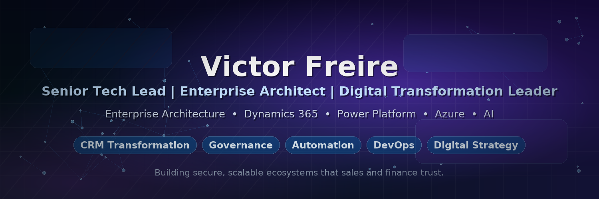

# Victor Freire

### Senior Tech Lead | Enterprise Architect | Digital Transformation Leader

Helping organisations transform revenue operations through Enterprise Architecture, AI, Dynamics 365 and Power Platform solutions.

With 20+ years of experience, I bridge business strategy and technology execution to deliver scalable, secure and measurable outcomes.

 

---

## Executive Summary

Technology leader specialising in enterprise architecture, CRM transformation, AI adoption and governance.

Experienced in aligning technology investment with business outcomes across Sales, Finance, Revenue Operations and Customer Success functions.

Core expertise includes Dynamics 365, Power Platform, Azure, DevOps and enterprise-scale transformation programmes.

---

## Business Impact

- Leading enterprise CRM transformation initiatives
- Driving AI adoption across business operations
- Designing scalable integration architectures
- Establishing governance frameworks for Dynamics 365 and Power Platform
- Modernising Sales, Finance and Customer Success processes
- Enabling secure enterprise automation at scale

---

## Featured Initiatives

### Dynamics 365 Enterprise Architecture

Designing scalable CRM ecosystems supporting global sales operations, customer engagement and revenue growth.

### Power Platform Governance

Building governance frameworks that ensure security, compliance and maintainability across enterprise applications.

### AI Transformation

Leveraging Microsoft Copilot, automation and AI-driven workflows to accelerate business outcomes.

### Revenue Operations Engineering

Integrating Dynamics 365, ERP systems, DealHub CPQ and customer intelligence platforms into a unified ecosystem.

### Enterprise Release Management

Driving release governance, DevOps adoption and software delivery excellence across distributed teams.

---

## Technology Focus

### Enterprise Platforms

  
  
  
  
  

### Architecture & Governance

- Enterprise Architecture
- Governance Frameworks
- Security & Compliance
- Application Lifecycle Management
- DevOps Excellence

### Innovation

- Artificial Intelligence
- Microsoft Copilot
- Business Automation
- Digital Transformation

---

## Current Priorities

- AI Adoption & Governance
- Enterprise Architecture
- Dynamics 365 Transformation
- Power Platform Governance
- Integration Modernisation
- DevSecOps & ALM Excellence

---

## Leadership & Community

- Microsoft Business Applications CAB
- Enterprise Architecture & Digital Transformation
- Dynamics 365 & Power Platform Strategy
- Technology Leadership & Mentoring
- Cross-functional collaboration across Sales, Finance and Technology teams

---

## Engineering Footprint

  

---

## Let's Connect

